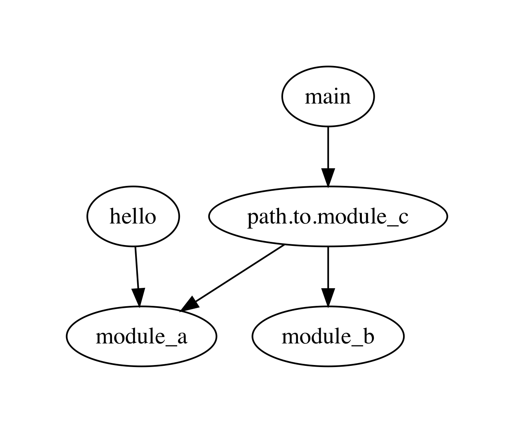
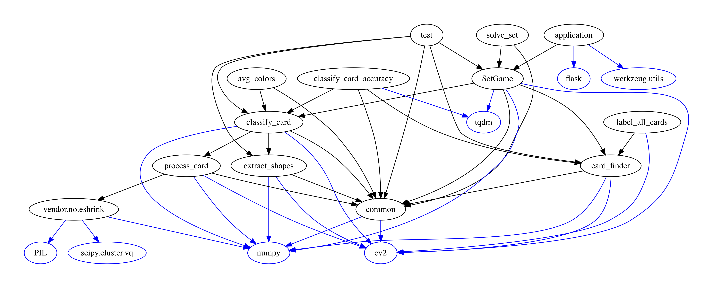

# import-visualizer
Visualize the import relationships between all modules in a python codebase. Works with Python 2 or 3.

__Very much a work in progress.__

Does not yet play well with relative imports (`from .. import blah`). Prefer `from my.abs.path import blah`.

## Install

Better process coming soon, hopefully.

__Python 2__
```
python -m virtualenv venv
source venv/bin/activate
pip install -r requirements.txt
```

__Python 3__

```
python3 -m venv venv3
source venv3/bin/activate
pip install -r requirements.txt
```

## Usage

```
# must have venv/venv3 activated
$ python src/vis.py <root project directory>
```

__Example:__

Running the visualizer on the toy `project` directory in this repository:

```
$ python src/vis.py project

Module dependencies:

hello
    module_a

main
    path.to.module_c

module_a

module_b

module_d

path

path.to

path.to.module_c
    module_a
    module_b
```

Also displays with `graphviz`:



Another example graph from a [slightly more substantial project](https://github.com/nicolashahn/set-solver) (blue arrows/nodes indicate modules where the code does not live in the project directory [such as modules installed through pip]):


